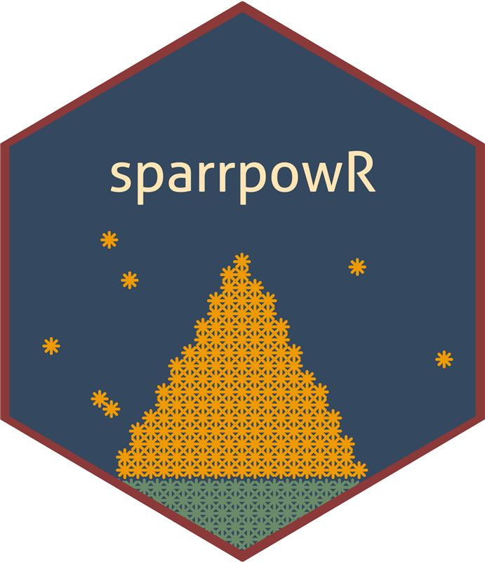
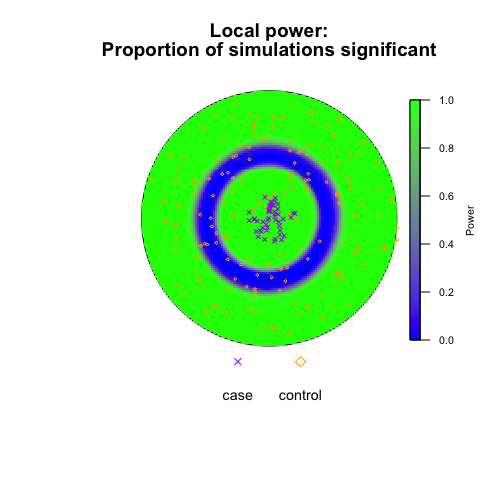
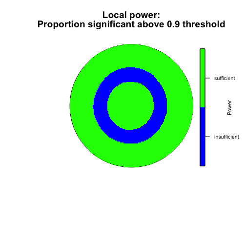

sparrpowR: Power Calculation for the Spatial Relative Risk function 
===================================================

<!-- badges: start -->
<!-- badges: end -->

<h2 id="overview">

Overview

</h2>

The `sparrpowR` package is a suite of `R` functions to calculate the statistical power to detect clusters using the kernel-based spatial relative risk function that are estimated using the  [sparr](https://CRAN.R-project.org/package=sparr) package. Basic visualization is also supported. 

<h2 id="install">

Installation

</h2>

To install the release version from CRAN:

    install.packages("sparrpowR")

To install the development version from GitHub:

    devtools::install_github("machiela-lab/sparrpowR")

<h2 id="available-functions">

Available functions

</h2>

<table>
<colgroup>
<col width="30%" />
<col width="70%" />
</colgroup>
<thead>
<tr class="header">
<th>Function</th>
<th>Description</th>
</tr>
</thead>
<tbody>
<td><code>spatial_power</code></td>
<td>Main function. Compute the statistical power of a spatial relative risk function using randomly generated data.</td>
</tr>
<td><code>spatial_data</code></td>
<td>Generate random bivariate data for a spatial relative risk function.</td>
</tr>
<td><code>jitter_power</code></td>
<td>Compute the statistical power of a spatial relative risk function using previously collected data.</td>
</tr>
<td><code>spatial_plots</code></td>
<td>Easily make multiple plots from <code>spatial_power</code>, <code>spatial_data</code>, and <code>jitter_power</code> outputs.</td>
</tr>
</tbody>
<table>

## Usage
``` r
library(sparrpowR)
set.seed(1234)

# ----------------- #
# Run spatial_power #
# ----------------- #

# Circular window with radius 0.5
# Uniform case sampling within a disc of radius of 0.1 at the center of the window
# Complete Spatial Randomness control sampling
# 20% prevalence (n = 300 total locations)
# Statistical power to detect both case and control relative clustering
# 100 simulations (more recommended for power calculation)

unit.circle <- spatstat::disc(radius = 0.5, centre = c(0.5,0.5))

foo <- spatial_power(win = unit.circle,
                     sim_total = 100,
                     x_case = 0.5,
                     y_case = 0.5,
                     samp_case = "uniform",
                     samp_control = "CSR",
                     r_case = 0.1,
                     n_case = 50,
                     n_control = 250,
                     cascon = TRUE)
                     
# ----------------------- #
# Outputs from iterations #
# ----------------------- #

# Mean and standard deviation of simulated sample sizes and bandwidth
stats::mean(foo$n_con); stats::sd(foo$n_con)    # controls
stats::mean(foo$n_cas); stats::sd(foo$n_cas)    # cases
stats::mean(foo$bandw); stats::sd(foo$bandw)    # bandwidth of case density (if fixed, same for control density) 

# Global Test Statistics
## Global maximum relative risk: Null hypothesis is mu = 1
stats::t.test(x = foo$s_obs, mu = 0, alternative = "two.sided")

## Integral of log relative risk: Null hypothesis is mu = 0
stats::t.test(x = foo$t_obs, mu = 1, alternative = "two.sided")

# ----------------- #
# Run spatial_plots #
# ----------------- #

spatial_plots(foo,
              p_thresh = 0.9,
              chars = c(4,5),
              sizes = c(0.6,0.3),
              cols = c("blue", "green", "red", "purple", "orange"))
```


