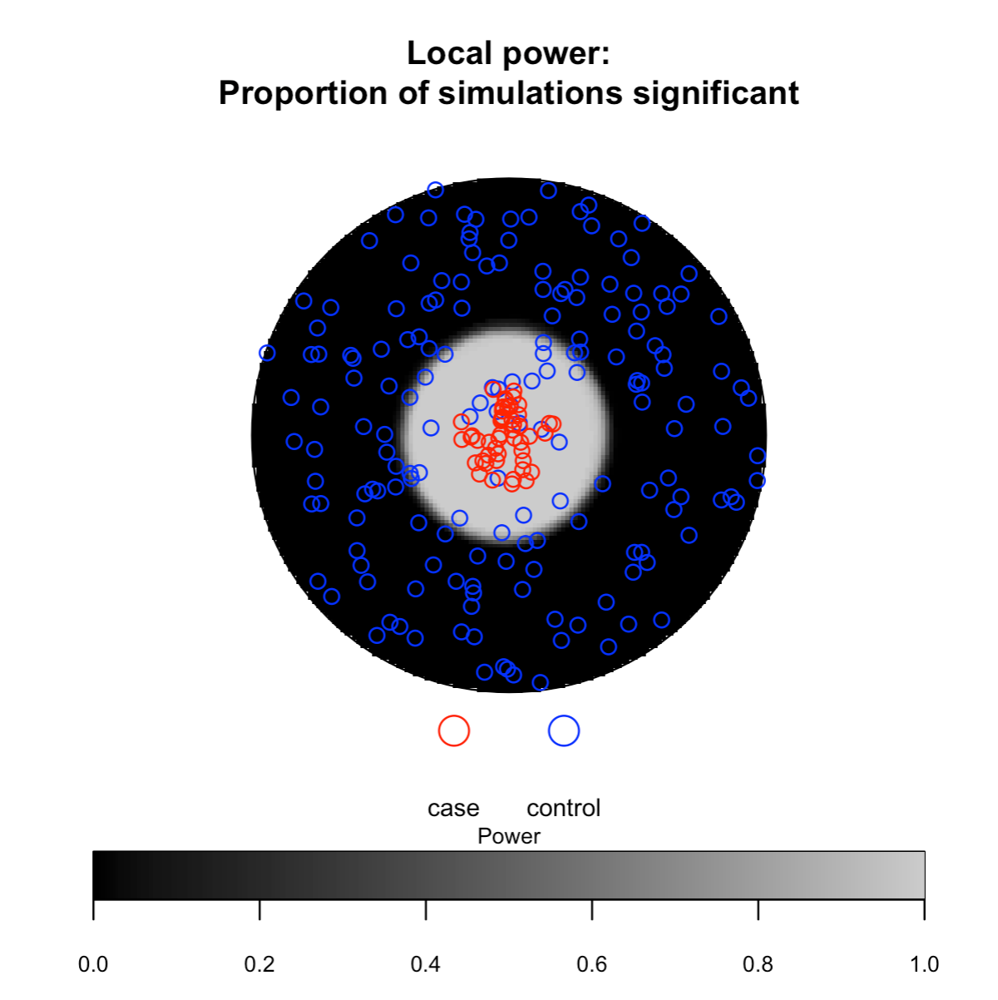
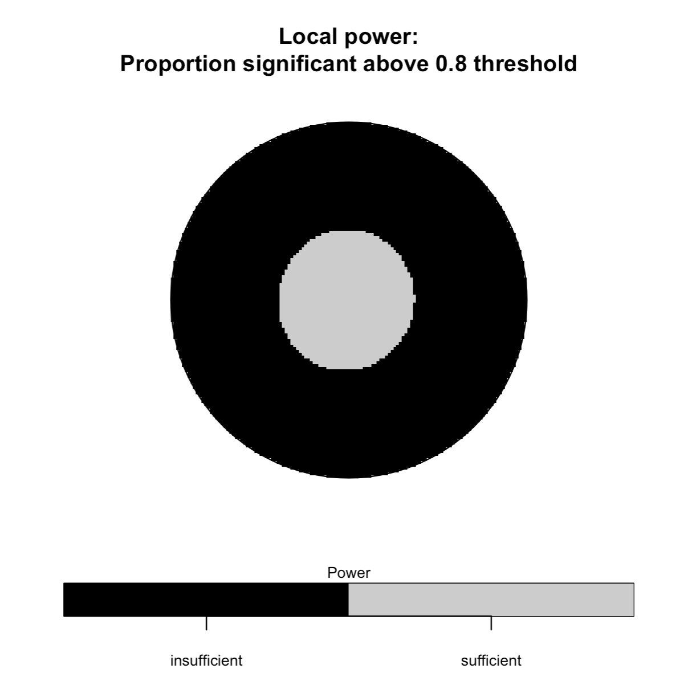
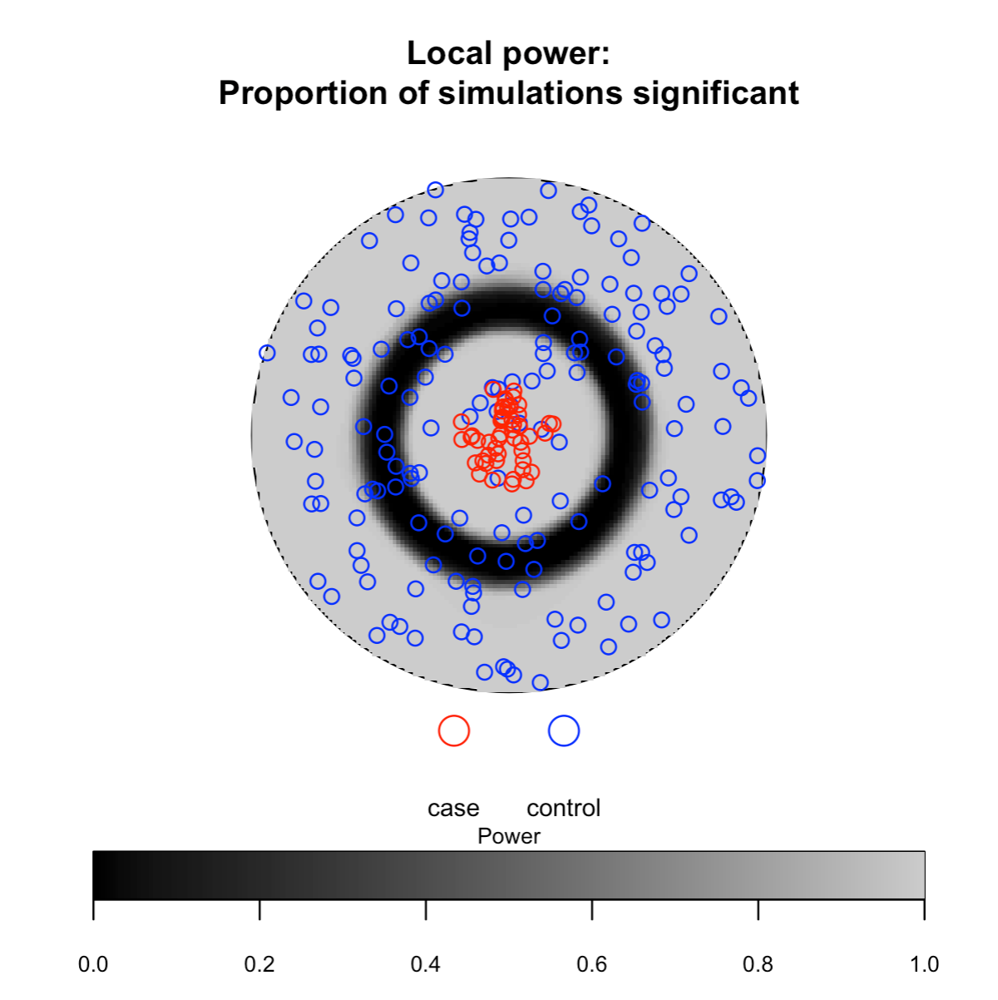
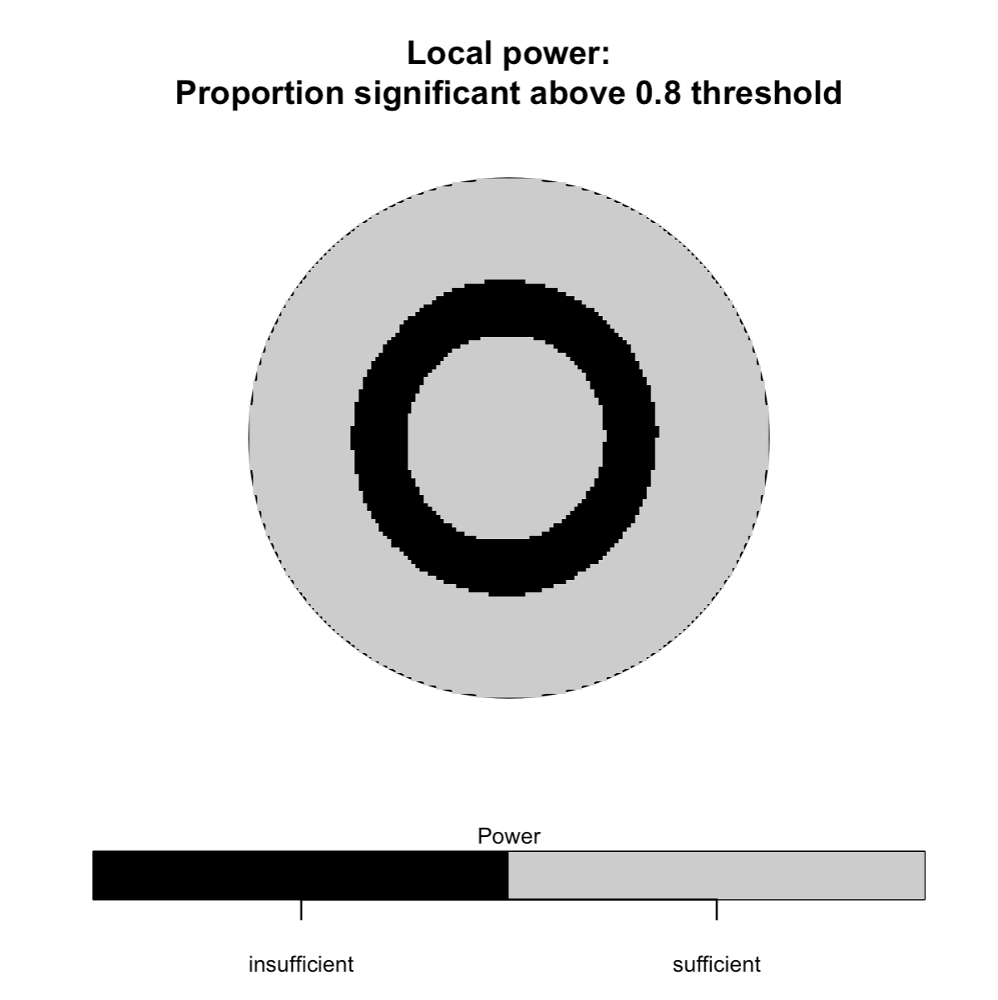

sparrpowR: Power analysis to detect spatial relative clusters 
===================================================

<!-- badges: start -->
[](https://cran.r-project.org/package=sparrpowR)
[](https://cran.r-project.org/package=sparrpowR)
[](https://r-pkg.org/pkg/sparrpowR)
[](https://opensource.org/licenses/Apache-2.0)

[](https://doi.org/10.5281/zenodo.5347997)
<!-- badges: end -->

**Date repository last updated**: December 01, 2022

<h2 id="overview">

Overview

</h2>

The `sparrpowR` package is a suite of `R` functions to calculate the statistical power to detect clusters using the kernel-based spatial relative risk function that is estimated using the  [sparr](https://CRAN.R-project.org/package=sparr) package. Basic visualization is also supported. 

<h2 id="install">

Installation

</h2>

To install the release version from CRAN:

    install.packages("sparrpowR")

To install the development version from GitHub:

    devtools::install_github("machiela-lab/sparrpowR")

<h2 id="available-functions">

Available functions

</h2>

<table>
<colgroup>
<col width="30%" />
<col width="70%" />
</colgroup>
<thead>
<tr class="header">
<th>Function</th>
<th>Description</th>
</tr>
</thead>
<tbody>
<td><code>spatial_power</code></td>
<td>Main function. Compute the statistical power of a spatial relative risk function using randomly generated data.</td>
</tr>
<td><code>spatial_data</code></td>
<td>Generate random bivariate data for a spatial relative risk function.</td>
</tr>
<td><code>jitter_power</code></td>
<td>Compute the statistical power of a spatial relative risk function using previously collected data.</td>
</tr>
<td><code>spatial_plots</code></td>
<td>Easily make multiple plots from <code>spatial_power</code>, <code>spatial_data</code>, and <code>jitter_power</code> outputs.</td>
</tr>
<td><code>pval_correct</code></td>
<td>Called within <code>spatial_power</code> and <code>jitter_power</code>, calculates various multiple testing corrections for the alpha level.</td>
</tr>
</tbody>
<table>

<h2 id="authors">

Authors

</h2>

* **Ian D. Buller** - *Occupational and Environmental Epidemiology Branch, Division of Cancer Epidemiology and Genetics, National Cancer Institute, National Institutes of Health, Rockville, Maryland* - [GitHub](https://github.com/idblr) - [ORCID](https://orcid.org/0000-0001-9477-8582)

* **Derek W. Brown** - *Integrative Tumor Epidemiology Branch, Division of Cancer Epidemiology and Genetics, National Cancer Institute, National Institutes of Health, Rockville, Maryland* - [GitHub](https://github.com/derekbrown12) - [ORCID](https://orcid.org/0000-0001-8393-1713)

See also the list of [contributors](https://github.com/machiela-lab/sparrpowR/graphs/contributors) who participated in this package, including:

* **Tim A. Myers** - *Laboratory of Genetic Susceptibility, Division of Cancer Epidemiology and Genetics, National Cancer Institute, National Institutes of Health, Rockville, Maryland* - [GitHub](https://github.com/timyers)

## Usage

``` r
set.seed(1234) # for reproducibility

# ------------------ #
# Necessary packages #
# ------------------ #

library(sparrpowR)
library(spatstat.geom)
library(stats)

# ----------------- #
# Run spatial_power #
# ----------------- #

# Circular window with radius 0.5
# Uniform case sampling within a disc of radius of 0.1 at the center of the window
# Complete Spatial Randomness control sampling
# 20% prevalence (n = 300 total locations)
# Statistical power to detect both case and control relative clustering
# 100 simulations (more recommended for power calculation)

unit.circle <- spatstat.geom::disc(radius = 0.5, centre = c(0.5,0.5))

foo <- spatial_power(win = unit.circle,
                     sim_total = 100,
                     x_case = 0.5,
                     y_case = 0.5,
                     samp_case = "uniform",
                     samp_control = "CSR",
                     r_case = 0.1,
                     n_case = 50,
                     n_control = 250)
                     
# ----------------------- #
# Outputs from iterations #
# ----------------------- #

# Mean and standard deviation of simulated sample sizes and bandwidth
mean(foo$n_con); stats::sd(foo$n_con)    # controls
mean(foo$n_cas); stats::sd(foo$n_cas)    # cases
mean(foo$bandw); stats::sd(foo$bandw)    # bandwidth of case density (if fixed, same for control density) 

# Global Test Statistics
## Global maximum relative risk: Null hypothesis is mu = 1
stats::t.test(x = foo$s_obs, mu = 0, alternative = "two.sided")

## Integral of log relative risk: Null hypothesis is mu = 0
stats::t.test(x = foo$t_obs, mu = 1, alternative = "two.sided")

# ----------------- #
# Run spatial_plots #
# ----------------- #

# Statistical power for case-only clustering (one-tailed test)
spatial_plots(foo)
```





```
# Statistical power for case clustering and control
clustering (two-tailed test)
## Only showing second and third plot
spatial_plots(foo, cascon = TRUE)
```




```
# --------------------------- #
# Multiple Testing Correction #
# --------------------------- #

# Same parameters as above
# Apply a conservative Bonferroni correction

set.seed(1234) # reset RNG

# Run spatial_power()
foo <- spatial_power(win = unit.circle,
                     sim_total = 100,
                     x_case = 0.5,
                     y_case = 0.5,
                     samp_case = "uniform",
                     samp_control = "CSR",
                     r_case = 0.1,
                     n_case = 50,
                     n_control = 250,
                     alpha = 0.05,
                     p_correct = "FDR")
                     
median(foo$alpha) # critical p-value of 3e-6 

# Run spatial_plots() for case-only clustering
## Only showing third plot
spatial_plots(foo, cascon = TRUE)
```


### Funding

This package was developed while the authors were postdoctoral fellows supported by the [Cancer Prevention Fellowship Program](https://cpfp.cancer.gov/) at the [National Cancer Institute](https://www.cancer.gov/).

### Acknowledgments

When citing this package for publication, please follow:

    citation("sparrpowR")

### Questions? Feedback?

For questions about the package please contact the maintainer [Dr. Ian D. Buller](mailto:ian.buller@alumni.emory.edu) or [submit a new issue](https://github.com/machiela-lab/sparrpowR/issues).
